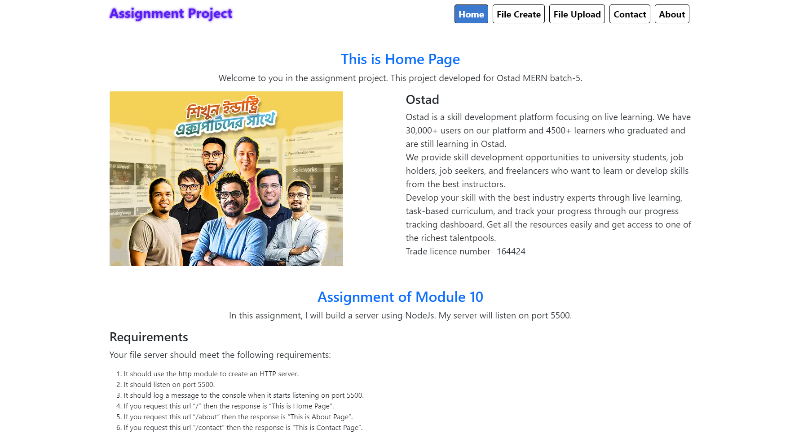

# Express.js App

This is a simple Express.js application designed to fulfill various requirements, including serving static files, handling different routes, creating and deleting files, and uploading files using both `multer` and `express-fileforge`.



**Live URL**: https://assignment2.netwix.xyz/


## Requirements Implemented:

1. **HTTP Server Creation**: The app utilizes the `express` module to create an HTTP server.
2. **Port Listening**: The server listens on port 5500.
3. **Logging**: A message is logged to the console when the server starts listening on port 5500.
4. **Routing**:
   - `/`: Displays the Home Page.
   - `/about`: Displays the About Page.
   - `/contact`: Displays the Contact Page.
   - `/file-create`: Renders a page to create files.
   - `/file-upload`: Renders a page to upload files.
5. **File Operations**:
   - `fs.writeFile()`: Creates a file named `demo.txt` with the content "hello world" when requested via `/file-create`.
   - File deletion is supported via `/fileDelete` route.
6. **File Upload**:
   - Utilizes `multer` for file uploading (`/uploadMulter` route).
   - Also demonstrates file upload using `express-fileforge` (`/uploadFileforge` route).

## Getting Started:

1. **Installation**:

   
           npm install


2. **Run the Server**:  
      ```bash
           node app.js

3. **Accessing Routes**:
- Home Page: [http://localhost:5500/](http://localhost:5500/)
- About Page: [http://localhost:5500/about](http://localhost:5500/about)
- Contact Page: [http://localhost:5500/contact](http://localhost:5500/contact)
- Create File Page: [http://localhost:5500/file-create](http://localhost:5500/file-create)
- Upload File Page: [http://localhost:5500/file-upload](http://localhost:5500/file-upload)

## Dependencies:

- Express.js
- Body-parser
- EJS
- Multer
- Express-fileforge

## Notes:

- Ensure proper file permissions for file operations.
- Customize routes and functionalities as per project requirements.

## Author:

[Your Name/Email/Contact Information]
